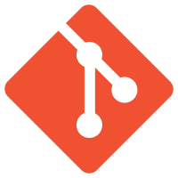

Git
====

## Transferring from TFS to git

#### There is a Git tutorial available [here](https://try.github.io/) to try git commands

## About Git

* NOTE: "Git" is not the same as "GitHub"
    - ***Git*** is a Version Control Repository Framework
    - ***GitHub*** is a company (the most popular) that hosts git repositories and allows them to be viewed from a web interface
         
        
        
* Unlike TFS, Git does not show what files are currently edited on other user's machines. There is much more of a chance for what is called a "merge conflict" (Two or more simultaneous edits to the same file, which cannot both be pushed to the same repository)

* Created by Linux developers (Initial Release in )

* According to [Wikipedia], has an "emphasis on speed, data integrity, and support for distributed, non-linear workflows."

[Wikipedia]: https://en.wikipedia.org/wiki/Git_(software)

## Comparison

### **Git** 
 - is integrated into *some* IDEs and coding environments, however is mostly just a mask to the git commands below (therefore, easy to implement)
 - Open Source, has no "owner"

### **TFS** 
 - is integrated into Visual Studio and somewhat into Eclipse, but that is more or less it
 - Owned by Microsoft
 - Now allows git integration into it's main version control framework

### Commits
* A Commit is a set of changes that have been made to a set of files
* All changes are tracked using commits, which contain information on new files, edited files, deleted files, and so on
* The command `commit` creates a new commit with the files that are currently being tracked (were included in the `add`)
* The command `push` sends local commits to the remote

### Commands

| Action |TFS (From inside Visual Studio)   |Git (Using command line interface)   |
|-----|------|--------|
|Pull changes from the remote server to the local drive|"Get latest"| `>$ git pull`  |
| Push changes made locally to the remote server |"Check in Pending Changes"| `>$ git add [regex]`  `>$ git commit -m "[Commit Message]"`  `>$ git push`  |
| Get rid of local changes and return to the files on the remote server | "Undo Pending Changes"| `>$ git add [regex]`  `>$ git reset --hard`|
| Calculate the differences between the local files and the remote files | "Compare"| `>$ git status`|

### Branches

* Branches are separate portions of the same repository
* Different branches do not *need* to contain the same files or commits
* To create a new branch, the command is `>$ git branch "new-branch-name"`
    - Creates a branch with the given name that contains all of the same files and commits as the branch that it was created from
    - To create a branch that has no files in it, use the `--orphan` parameter

## Other sources of information on git

- [Comparison of TFS and git](http://blog.jessitron.com/2012/12/tfs-and-git-comparison.html)
- https://git-scm.com/doc
- https://try.github.io/
- https://www.codecademy.com/learn/learn-git
- https://www.atlassian.com/git/
- http://gitimmersion.com/

### Features of Version Control Systems - Via [blog.jessitron.com](http://blog.jessitron.com/2012/12/tfs-and-git-comparison.html)

|Feature| TFS| git |
|-----------|----------|---------|
|Save source code | Yes | Yes |
|Retain all version history | Yes | Yes |
|Group changes into sets | Yes (file level only) | Yes |
|Automatic change detection | in 2012 | Yes |
|Branch | Yes (not easy) | Yes (very easy) |
|Merge between related branches | Yes | Yes (very easy) |
|Safe merge between unrelated branches | No | Yes |
|Offline access to history | No | Yes |
|Offline commit | No | Yes |
|Offline commit | No | Yes |
|Sneaky automatic merges on the server | Yes | No |
|Enforce requirements before commit | Yes | No |
|Private local branches | No | Yes |
|Learning curve for users | Low | Medium |
|Learning curve for administrators | Very high | Medium-high |
|GUI support | Strong | Poor |
|Conditional commit (if tests work) | Yes | No |
|Save IDE state | Yes | No |
|Work item tracking | Yes | No |
|Automated builds and tests | Yes | No |
|Analytics and charting | Yes | No |
|Manual test tracking | Yes | No |
|Installation | 1/2 day | 10 minutes |
|Deployment, central and local | days to months | 1 day |
|Free online hosting | Yes | Yes |
|Cost | $$$ | free |
|Security | Yes | No |